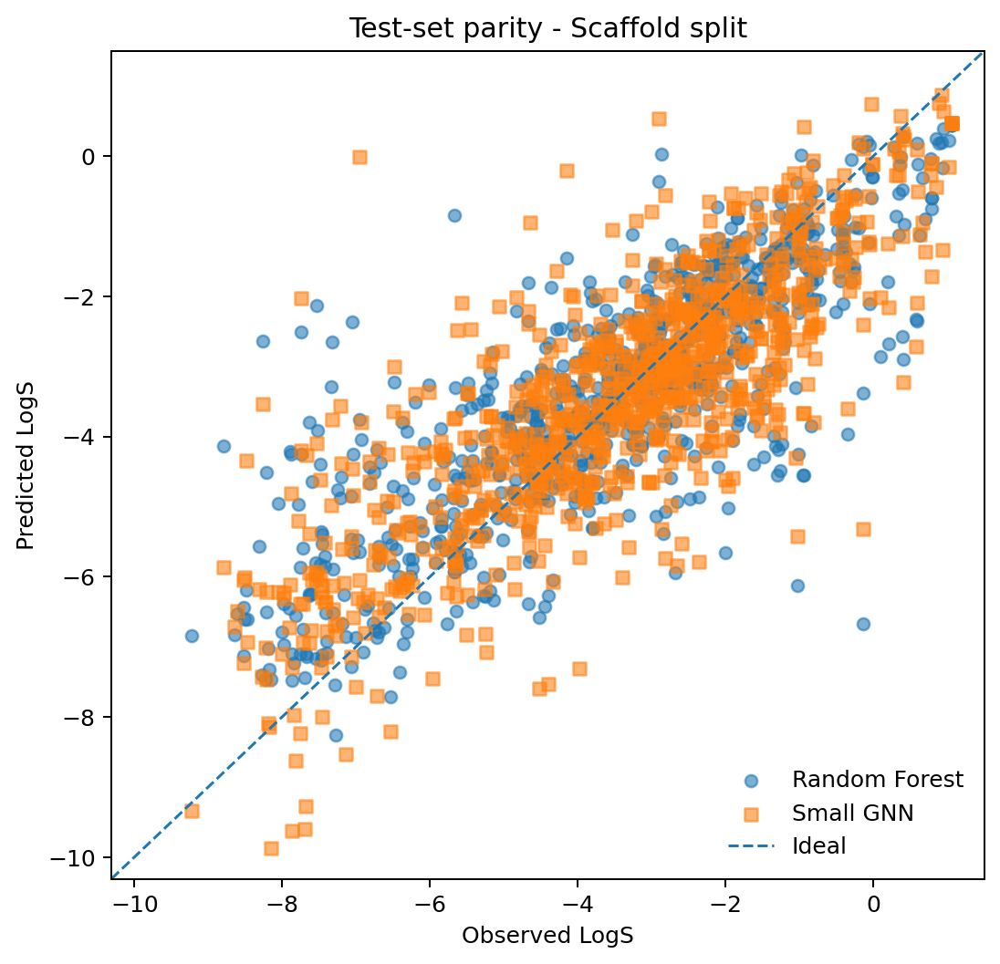

# ADMET GNN Benchmark

[](https://github.com/drjoykarmakar/admet-gnn-benchmark/actions/workflows/ci.yml)

> This repository is a reproducible ADMET property-prediction benchmark. It compares fingerprint baselines and a small PyTorch GNN under random and scaffold splits, with emphasis on data cleaning and honest evaluation rather than architectural novelty.

This project predicts aqueous solubility from molecular SMILES using the public TDC `Solubility_AqSolDB` regression dataset.
The target is AqSolDB LogS, where S is aqueous solubility in mol/L.
The benchmark compares a serious classical baseline (Morgan fingerprints plus RDKit descriptors with a Random Forest) against a small message-passing graph neural network.
Both models are evaluated on the same cleaned molecules under both random and Bemis-Murcko scaffold splits.
The random split measures interpolation among molecules drawn from a similar overall distribution; the scaffold split is a harder test of transfer to new core chemotypes.
Cleaning is performed with RDKit and logs invalid structures, parent-fragment selection, neutralization, deduplication, and conflicting-label handling.
Regression performance is reported with RMSE, MAE, and R2 on held-out test sets; no single metric is treated as sufficient.
The analysis includes parity plots, residual inspection, representative failure molecules, and a simple fingerprint-similarity applicability-domain check.
All experiment seeds and model settings live in configuration files, and generated tables/figures are reproducible from command-line scripts.
Results are reported even when the classical model outperforms the GNN; the goal is a credible benchmark, not a model-showcase narrative.
This repository does not perform de novo design, docking, clinical prediction, or claim to discover drug candidates.

## Problem

Molecular property models are often evaluated with random train/test splits. For chemical data, that can be optimistic because close analogs or molecules sharing the same scaffold can appear on both sides of the split. A model may therefore look strong while relying on interpolation within familiar chemical series.

This repository asks a narrower and more useful question:

**How do a strong fingerprint baseline and a small GNN compare when evaluated on both random and scaffold splits of the same cleaned ADMET dataset?**

The project deliberately keeps the modeling simple so that data quality, split choice, and error analysis remain visible.

## Dataset

**Main endpoint:** aqueous solubility regression (LogS, with S in mol/L)

- Dataset: `Solubility_AqSolDB`
- Provider: Therapeutics Data Commons (TDC)
- TDC page: https://tdcommons.ai/single_pred_tasks/adme/
- Original dataset: AqSolDB, Sorkun, Khetan, and Er, *Scientific Data* 6, 143 (2019)
- Original paper: https://doi.org/10.1038/s41597-019-0151-1
- Original data DOI: https://doi.org/10.7910/DVN/OVHAW8
- Dataset license: CC BY 4.0
- Date source pages accessed: 2026-09-26
- TDC-reported dataset size before this repository's cleaning: 9,982 molecules
- Size after local cleaning: **9,220 molecules**

AqSolDB is already a curated dataset, but this repository still applies a documented local standardization pipeline. That is intentional: benchmark inputs should be defined by code in the repository rather than assumed to match an upstream curation state forever.

### Local cleaning pipeline

`src/data.py` performs the following steps:

1. Require a non-empty SMILES and numeric target.
2. Parse with `Chem.MolFromSmiles` and drop molecules that fail RDKit sanitization.
3. Apply RDKit `Cleanup` normalization.
4. Select the parent fragment with `FragmentParent` to remove common counterions/salts and keep a chemically meaningful parent structure.
5. Apply RDKit `Uncharger` as a simple, documented charge standardization step.
6. Re-sanitize and write canonical isomeric SMILES.
7. Collapse duplicate standardized structures.
8. Treat duplicate labels within 0.01 LogS as agreement, matching the tolerance used in the original AqSolDB curation; by default, drop a standardized structure entirely when labels disagree beyond that threshold. Optional `mean` and `median` policies are available for sensitivity analysis.

The cleaning report is written as JSON and records how many rows are removed or collapsed at each step.

| Cleaning stage | Count |
|---|---:|
| Rows loaded | 9,982 |
| Missing/invalid target | 0 |
| Missing/blank SMILES | 0 |
| RDKit parse/sanitization failures | 0 |
| Standardization failures | 0 |
| Exact input-SMILES duplicate rows | 0 |
| Standardized duplicate rows collapsed | 3 |
| Conflicting standardized-label groups | 237 |
| Rows dropped because of label conflict | 759 |
| Final molecules | 9,220 |

## Methods

### Classical baseline

The baseline is designed to be competitive rather than ceremonial:

- Morgan fingerprint, radius 2, 2,048 bits
- RDKit descriptors: molecular weight, TPSA, H-bond donors, H-bond acceptors, MolLogP, and rotatable bonds
- `RandomForestRegressor` with 300 trees per candidate
- Light validation-only search over `max_features` (`sqrt`, 0.25) and `min_samples_leaf` (1, 2)
- Fixed random seeds and explicit `n_jobs` configuration
- Saved validation/test predictions plus the complete tuning history

The test set is not used for model or hyperparameter selection. After validation selects a configuration, the selected forest is evaluated on the test partition without refitting on validation examples; this keeps its training exposure comparable with the later GNN, which uses validation data for early stopping rather than gradient updates.

### Graph neural network

The deep model is intentionally small and readable:

- Pure PyTorch; PyTorch Geometric is not required
- Atom features: element, degree, formal charge, aromaticity, hybridization, hydrogen count, and ring membership
- Bidirectional molecular connectivity with explicit graph batching implemented in `src/train.py`
- Three residual mean-neighbor message-passing layers by default
- Global mean pooling followed by a small MLP regression head
- Training-target standardization using **training-set statistics only**
- Adam optimizer with weight decay
- Validation-loss early stopping; the test set is evaluated only after the best validation checkpoint is restored
- Explicit "other" buckets for uncommon atom/bond categories so unusual chemistry is not silently discarded during featurization

`src/features.py` also computes bond type, conjugation, and ring-membership features. The first GNN intentionally does not consume those edge attributes; it uses atom features plus bond connectivity only. This keeps the architecture easy to audit and leaves edge-aware message passing as a clear future experiment rather than quietly increasing model complexity.

PyTorch Geometric was left optional because it is unnecessary for a model of this size. The reference config defaults to CPU for the most portable deterministic run; `--device cuda` or `--device mps` can be used explicitly when available. A short CPU smoke run is available with `--demo`.

## Splits and leakage

Each model is trained and evaluated twice:

1. **Random split** - molecules are shuffled before train/validation/test partitioning.
2. **Scaffold split** - Bemis-Murcko scaffolds are kept together so that closely related core chemotypes are less likely to cross split boundaries. Molecules without a Murcko core are assigned to a single `<ACYCLIC>` group rather than given artificial per-molecule scaffolds.

A random split is useful, but for molecular data it can reward interpolation across closely related analogs. If the same scaffold family is represented in both train and test data, a model can obtain an attractive score without demonstrating strong generalization to new chemical series. The scaffold split is therefore expected to be harder and is treated as the more conservative view of out-of-scaffold performance.

The full run produced:

- Random split: **7,376 / 922 / 922** train/validation/test molecules
- Scaffold split: **7,376 / 922 / 922** train/validation/test molecules
- Pairwise scaffold overlap in the scaffold split: **0**

Scaffold groups are indivisible, so realized train/validation/test fractions can in general differ from the requested 80/10/10 proportions. The split audit records both requested and realized sizes. `src.splits` also asserts zero pairwise scaffold overlap for the scaffold split. Both random and scaffold assignments are saved explicitly rather than regenerated implicitly during training.

## Metrics

Regression results are reported with:

- **RMSE** - emphasizes larger errors
- **MAE** - easier to interpret as a typical absolute error in LogS units
- **R2** - reports explained variance but can be unstable or negative on difficult held-out sets

No result is summarized by R2 alone.

## Results

The full benchmark was run on 9,220 cleaned, standardized molecules using the fixed random seed and configuration described above.

| Model | Representation | Random RMSE | Random MAE | Random R2 | Scaffold RMSE | Scaffold MAE | Scaffold R2 |
|---|---|---:|---:|---:|---:|---:|---:|
| Random Forest | Morgan + RDKit descriptors | 0.984 | 0.664 | 0.803 | 1.264 | 0.900 | 0.657 |
| Small GNN | Molecular graph | 1.110 | 0.754 | 0.749 | 1.277 | 0.946 | 0.650 |

**Interpretation.** Both models performed worse under the Bemis-Murcko scaffold split than under the random split, consistent with scaffold splitting providing a more difficult out-of-scaffold generalization setting. The Random Forest achieved lower test error than the small GNN on both splits. On the random split, RF RMSE was 0.984 versus 1.110 for the GNN; on the scaffold split, RMSE was 1.264 versus 1.277.

The performance gap between the two models became much smaller under scaffold splitting. More importantly, neither representation avoided the degradation associated with holding out scaffold families. These comparisons describe this fixed benchmark run and should not be interpreted as a statistical significance test or as evidence that one model class is universally superior.

## Figure

Test-set parity plots were generated from the saved predictions for both random and scaffold splits.



The scaffold-split parity plot provides a visual complement to the numerical metrics above. Additional random-split, residual, applicability-domain, learning-curve, and failure-analysis figures are available under `results/figures/`.

## Error analysis

`src/evaluate.py`, `src/plots.py`, and `scripts/make_report.py` implement post-training analysis from saved artifacts. Report generation does not retrain either model. It produces:

- parity plots for random and scaffold test sets
- signed residual-versus-observed plots for both splits
- largest absolute-error molecules for every model/split
- maximum training-set Morgan/Tanimoto similarity and nearest training SMILES for every test molecule
- absolute error versus nearest-training-set similarity
- broad similarity-bin error summaries
- an RDKit grid of high-error scaffold-split molecules
- descriptor-based plain-language structural context for each selected failure molecule
- GNN train/validation learning curves when `gnn_history.csv` is available

The applicability-domain view is intentionally modest: nearest-neighbor Tanimoto is treated as a structural-proximity diagnostic, not calibrated uncertainty, and the code does not invent a universal similarity cutoff. Chemistry notes report observable 2D properties such as molecular weight, cLogP, TPSA, hydrogen-bond counts, flexibility, aromatic rings, and formal charge. They explicitly do not assign a causal reason for a model error.

## What failed

The small GNN did not outperform the fingerprint-plus-descriptor Random Forest in this benchmark. Its random-split performance was notably weaker, while scaffold-split performance was similar but still slightly worse.

Both models also showed substantial degradation from random to scaffold evaluation. Random Forest RMSE increased from 0.984 to 1.264, while GNN RMSE increased from 1.110 to 1.277. This demonstrates why conclusions based only on a random molecular split can give a more optimistic view of generalization than a scaffold-held-out evaluation.

Increasing model complexity was therefore not sufficient to outperform a strong classical molecular representation in this experiment. This negative result is retained deliberately: the purpose of the benchmark is to compare modeling choices transparently rather than construct a narrative in which the GNN must win.

## Limitations

- AqSolDB aggregates measurements from multiple source datasets. Even after upstream curation, experimental heterogeneity and residual label noise remain plausible.
- Parent-fragment selection and neutralization simplify representation and can remove information about salt form or protonation state relevant to measured solubility.
- A 2D SMILES/graph model does not explicitly represent crystal packing, polymorphs, pH, temperature, kinetic versus thermodynamic solubility, or assay protocol.
- A scaffold split is stricter than a random split but is not a perfect simulation of prospective medicinal chemistry.
- A small benchmark dataset cannot establish broad ADMET generalization.
- Applicability-domain analysis based on Morgan Tanimoto similarity is only a simple structural-proximity diagnostic, not a calibrated uncertainty model.
- Hyperparameter search is intentionally limited; this repository is not a leaderboard-optimization exercise.

## Reproducibility

Recommended environment: Python 3.11.

```bash
python -m venv .venv
source .venv/bin/activate  # Windows: .venv\Scripts\activate
python -m pip install --upgrade pip
pip install -r requirements.txt
```

Download and clean the main dataset through PyTDC:

```bash
python -m src.data \
  --output data/processed/solubility_aqsoldb_clean.csv \
  --report data/processed/solubility_aqsoldb_cleaning.json
```

For an offline or pre-downloaded TDC export containing `Drug` and `Y` columns, bypass the downloader explicitly:

```bash
python -m src.data \
  --input-file /path/to/solubility_aqsoldb.csv \
  --output data/processed/solubility_aqsoldb_clean.csv \
  --report data/processed/solubility_aqsoldb_cleaning.json
```

The local-input path uses the same cleaning code as the PyTDC path; it exists to make reruns robust to package/network availability, not to change the benchmark dataset.

Create the baseline feature matrix:

```bash
python -m src.features \
  --input data/processed/solubility_aqsoldb_clean.csv \
  --output data/processed/solubility_aqsoldb_features.npz
```

Create and audit both split definitions:

```bash
python -m src.splits \
  --input data/processed/solubility_aqsoldb_clean.csv \
  --output-dir data/processed/splits \
  --seed 42
```

The split command writes `random.csv`, `random.json`, `scaffold.csv`, and `scaffold.json`. The JSON files record realized partition sizes, unique scaffold count, and pairwise scaffold-overlap counts.

Run the classical baseline on both saved split definitions:

```bash
python scripts/run_baseline.py --config configs/default.yaml
```

This writes `results/tables/baseline_metrics.csv`, `results/tables/baseline_tuning.csv`, and per-molecule validation/test predictions under `results/predictions/`. The runner also checks that the split CSV and feature archive contain the same standardized SMILES and matching target values, which catches stale intermediate artifacts before training.

Train the GNN on both saved split definitions:

```bash
python scripts/run_gnn.py --config configs/default.yaml
```

For a short CPU smoke run before committing to the full epoch budget:

```bash
python scripts/run_gnn.py --config configs/default.yaml --demo
```

The GNN runner writes `results/tables/gnn_metrics.csv`, `results/tables/gnn_history.csv`, and `gnn_random.csv` / `gnn_scaffold.csv` under `results/predictions/`. It validates the cleaned dataset against each saved split, caches graph featurization across the two runs, standardizes targets from the training partition only, and records the best epoch, total epochs trained, parameter count, and held-out metrics.

Regenerate result tables and figures from saved predictions:

```bash
python scripts/make_report.py --config configs/default.yaml
```

The report command requires all four saved prediction files (`baseline_random.csv`, `baseline_scaffold.csv`, `gnn_random.csv`, and `gnn_scaffold.csv`) and the saved split definitions. It recomputes test metrics from the prediction rows rather than trusting previously written summary CSVs. Outputs include:

- `results/tables/benchmark_summary.csv`
- `results/tables/benchmark_results_long.csv`
- `results/tables/applicability_random.csv` and `applicability_scaffold.csv`
- `results/tables/applicability_summary.csv`
- `results/tables/failure_cases.csv`
- parity, residual, applicability, failure-molecule, and optional learning-curve figures under `results/figures/`
- `results/report.md`, a compact generated report for review

Run tests:

```bash
python -m pytest -q
```

The reference environment passes **30 tests**. RDKit may emit deprecation warnings under the pinned compatibility environment; these warnings do not indicate test failures.

Raw datasets, model checkpoints, virtual environments, and caches are excluded by `.gitignore`. Small result tables and figures from the full benchmark run are intended to be committed so a reviewer can inspect the evidence without retraining first. Demo/subset outputs should stay uncommitted.

## Repository layout

```text
admet-gnn-benchmark/
  README.md
  LICENSE
  requirements.txt
  pyproject.toml
  configs/
    default.yaml
  data/
    raw/
    processed/
    README.md
  src/
    __init__.py
    data.py
    splits.py
    features.py
    models_baseline.py
    models_gnn.py
    train.py
    evaluate.py
    plots.py
  scripts/
    run_baseline.py
    run_gnn.py
    make_report.py
  notebooks/
    01_exploration.ipynb
  tests/
    test_smiles.py
    test_features.py
    test_splits.py
    test_evaluate.py
    test_baseline.py
    test_gnn.py
    test_train.py
    test_plots.py
    test_report.py
  results/
    tables/
    figures/
    predictions/
  .gitignore
```

`notebooks/` is optional exploratory material. Reproducible data processing, splitting, training, evaluation, and plotting live in importable modules under `src/`.

## What this repository does not claim

This repository does **not** claim to discover drugs, identify a clinical candidate, perform docking, replace experimental ADMET measurement, or establish a state-of-the-art architecture. It is a controlled molecular-property benchmark intended to show careful chemical data handling, sensible baselines, split-aware evaluation, and transparent error analysis.

## References

1. Sorkun MC, Khetan A, Er S. AqSolDB, a curated reference set of aqueous solubility and 2D descriptors for a diverse set of compounds. *Scientific Data*. 2019;6:143. https://doi.org/10.1038/s41597-019-0151-1
2. Huang K, Fu T, Gao W, et al. Therapeutics Data Commons: Machine Learning Datasets and Tasks for Drug Discovery and Development. *NeurIPS Datasets and Benchmarks*. 2021.
3. RDKit: Open-source cheminformatics. https://www.rdkit.org/